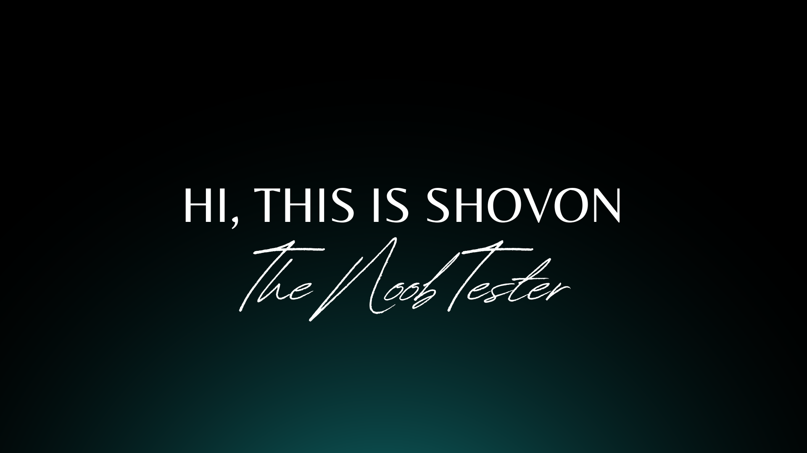

<!--
**mohaiminul-shovon/mohaiminul-shovon** is a ✨ _special_ ✨ repository because its `README.md` (this file) appears on your GitHub profile.

Here are some ideas to get you started:

- 🔭 I’m currently working on ...
- 🌱 I’m currently learning ...
- 👯 I’m looking to collaborate on ...
- 🤔 I’m looking for help with ...
- 💬 Ask me about ...
- 📫 How to reach me: ...
- 😄 Pronouns: ...
- ⚡ Fun fact: ...
-->

I am a Software QA professional, working in different industry for more than three years now. I am an ISTQB ® Certified tester which I achieved in 2019. 

🔭 Currently I am working as a Software QA Engineer in Norway based company in Bangladesh. I have worked in a debt collection project with a norwaegian client named as TK Helse. I am responsible for executing functional test, api test, database test, and documenting the product requirements. I have also worked with NTB tenchonology team where I worked in there API automation monitoring project.  

🌱 I have worked numerous API automation framework such as RestAssured and KARATE DSL along with Postman. I have successfully completed a whole automation script with KARATE framework with JAVA spring boot along with gradle. I have also completed a small automation project with RestAssured framework with JAVA. 

Some of my previous works are in this github profile. You can check them out and make contributions also if you like. All of these are just for demo my works. I am still making contributions every now and then. 

I am also writing about my learning in Medium and on my Linkedin profile. You can check them out by connecting with me over 

I am also providing service for full proof software testing solutions along with 
- Test plan and Test case generation
- Test execution on mobile application and web based application.
- Product requirement documents and functional documents.
- Bug report and defect management.
- API testing and automation of test suite.
- Web UI automation.

For any collaboration or service, you can reach me on my <a href = "mailto: mi.shovon23@gmail.com"> Email </a> address

<h3 align="left">Connect with me:</h3>

